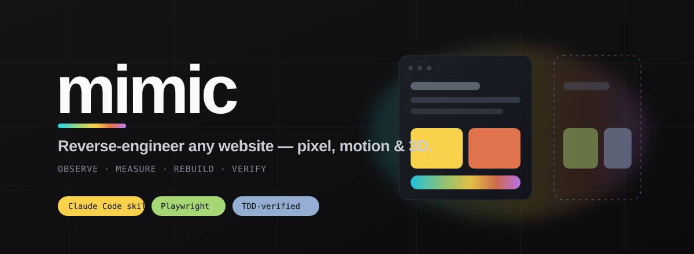
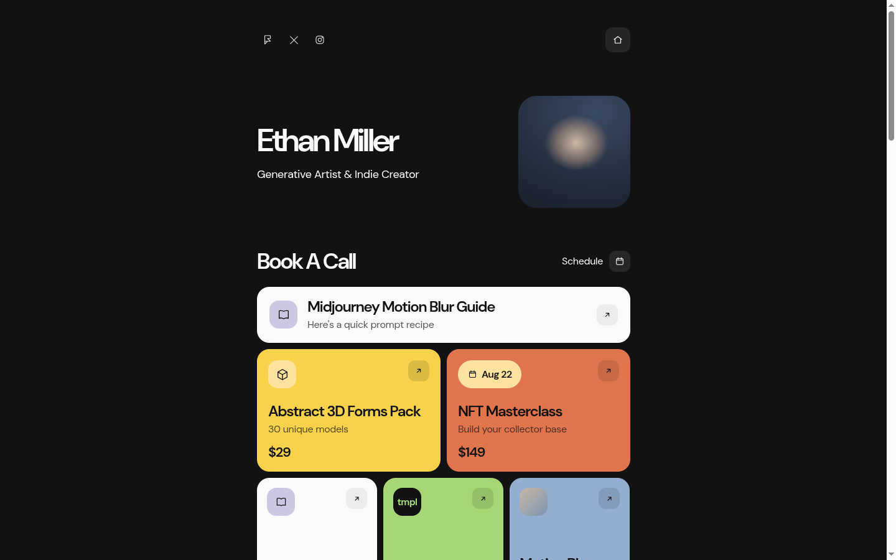

<div align="center">



# MIMIC

**Rebuild any website's layout, typography, motion, and WebGL/3D to pixel fidelity.** A [Claude Code](https://claude.com/claude-code) skill that reads a reference site as a specification and reproduces it with independent, clean, test-verified code.

[](https://claude.com/claude-code)
[](https://playwright.dev)
[](#tests)
[](https://nodejs.org)
[](./LICENSE)
[](https://github.com/sumanrox/mimic/pulls)
[](https://www.linkedin.com/in/sumanrox)

</div>

---

## What it does

Point it at a URL and it recovers the rules that produced the pixels: structure, layout mechanism, type scale, spacing system, color, components, responsive composition, interaction states, and motion (scroll reveals, springs, staggers, pinned and scrubbed timelines, and WebGL/3D). It then reimplements them with its own code and checks the result against the reference with an automated verifier. Every value comes from measuring the page in a real browser rather than guessing.

<div align="center">

<br/><sub>A full mirror produced by the skill (demo reconstruction, placeholder assets).</sub>
</div>

## Demo

The [`demo/`](./demo) folder is a full mirror the skill built of a real page: the LinksPage link-in-bio template at **https://linkspage.framer.website/**. It reproduces every section, all three responsive layouts, and the Framer reveal motion (rise, scale, spring, and a staggered scroll entrance).

Run it and compare against the original yourself:

```bash
git clone https://github.com/sumanrox/mimic.git
cd mimic
node skill/scripts/serve.mjs demo        # prints a localhost URL
# or, if you have it:  npx serve demo
```

Open the printed URL next to https://linkspage.framer.website/ and check the layout, the desktop, tablet, and mobile breakpoints, and the scroll reveals.

## Install

### Option A: one command

```bash
# straight from the repo, no publish needed:
npx github:sumanrox/mimic

# or, once published to npm:
npx mimic-skill
```

This copies the skill into `~/.claude/skills/mimic`. Install the browser toolchain once:

```bash
cd ~/.claude/skills/mimic && bash scripts/preflight.sh --fix
```

### Option B: from the bundle

Download [`mimic.skill`](./mimic.skill) and import it into Claude Code, or unzip it into `~/.claude/skills/`.

### Option C: manual

```bash
git clone https://github.com/sumanrox/mimic.git
cp -r mimic/skill ~/.claude/skills/mimic
cd ~/.claude/skills/mimic && bash scripts/preflight.sh --fix
```

## Usage

In Claude Code, describe the job and the skill triggers on its own:

```
/mimic https://some-site.com          full mirror
clone the hero + navbar from <url>    section or component
extract the design system from <url>  tokens only
recreate the scroll animation on <url> motion pattern
```

There are six modes: A full mirror, B section, C component with all states, D design-system extraction, E pattern extraction, and F redesign from a site's design DNA. The skill picks the narrowest mode that fits and tells you which one it chose.

## How it works

| # | Step | What happens |
|---|------|--------------|
| 0 | Pre-flight | `preflight.sh` checks Node, Playwright, Chromium, and ImageMagick; `--fix` installs what's missing. It won't start until the toolchain is ready. |
| 1 | Feasibility | `detect.js` fingerprints the stack, anti-bot and auth walls, WebGL/3D, scroll libraries, iframes, and fonts, then reports a capability ceiling up front. |
| 2 | Capture | `measure.js` records geometry, type, and color per viewport into `reference.baseline.json`, the source of truth for the tests. |
| 2.5 | Copy assets | `copy-assets.mjs` mirrors every fetched asset, including `.glb`/`.gltf`, into a local folder with a provenance manifest. |
| 3 | Route | each surface goes to mirror, motion-sampling, 3D-extract, or respect-and-document. |
| 4 | Build | one section per red-to-green test slice against the baseline, starting from the clean scaffold. |
| 5 | Validate | `verify.mjs` asserts computed styles, box metrics, and pixel diff at every viewport, and motion curves are re-sampled. |
| 6 | Report | what was replicated, substituted, or approximated, each labelled OBSERVED, INFERRED, or APPROXIMATE. |

## How it captures motion

Most tools flatten a designed animation into a generic fade. Mimic reads the real curve instead:

- `getAnimations()` for declared CSS and Web Animations API timelines.
- a MutationObserver sampler when the motion is driven per frame (Framer Motion, GSAP), which recovers the start transform (translate and scale), duration, spring overshoot, and per-item stagger.
- `scroll-scrub.js` for pinned and scroll-scrubbed timelines.
- reproduction of both the on-load entry cascade and the sequential scroll reveal.

## WebGL and 3D

It detects Three.js and Babylon, including module builds that expose no global, inventories the page's public 3D assets (`.glb`, `.gltf`, `.hdr`, `.ktx2`, shaders), and reloads them into a real Three.js scene (`three-scene.mjs`) for exact geometry and materials. When a scene is sealed, it falls back to a visual approximation and says so.

## Tests

The reconstruction runs red to green. The baseline is captured from the reference, so a passing build matches the reference rather than itself, and the seam under test is the built page's observable output. The comparison core ships with unit tests:

```bash
npm test        # node --test skill/tests/compare.test.mjs  -> 5/5
```

`verify.mjs` then asserts a built page against the baseline: green on a match, red on any drift.

## Limits

- Sealed WebGL, offscreen or obfuscated with no public assets, gets a high-fidelity approximation rather than an exact copy.
- Auth, CAPTCHA, and paywalls are respected, never bypassed; the public surface is mirrored and the gap is documented.
- Assets are copied for faithful mirroring and flagged `license:"unknown"`. Keeping or replacing each asset is a separate decision. Well-known copyrighted characters and brand logos are swapped for original stand-ins of the same geometry, not redrawn.
- OS font rasterization, licensed fonts, and live data are diffs no build can control. They are labelled, not hidden.

## Repo layout

```
skill/            the installable skill (SKILL.md, scripts/, references/, assets/scaffold, tests/)
mimic.skill       packaged bundle
bin/install.mjs   npx installer
demo/             a full mirror produced by the skill (linkspage reconstruction)
mimic.md          the underlying master prompt
assets/           banner + demo image
```

## License

[MIT](./LICENSE) © Suman Roy

<div align="center"><sub>Built with Claude Code.</sub></div>
